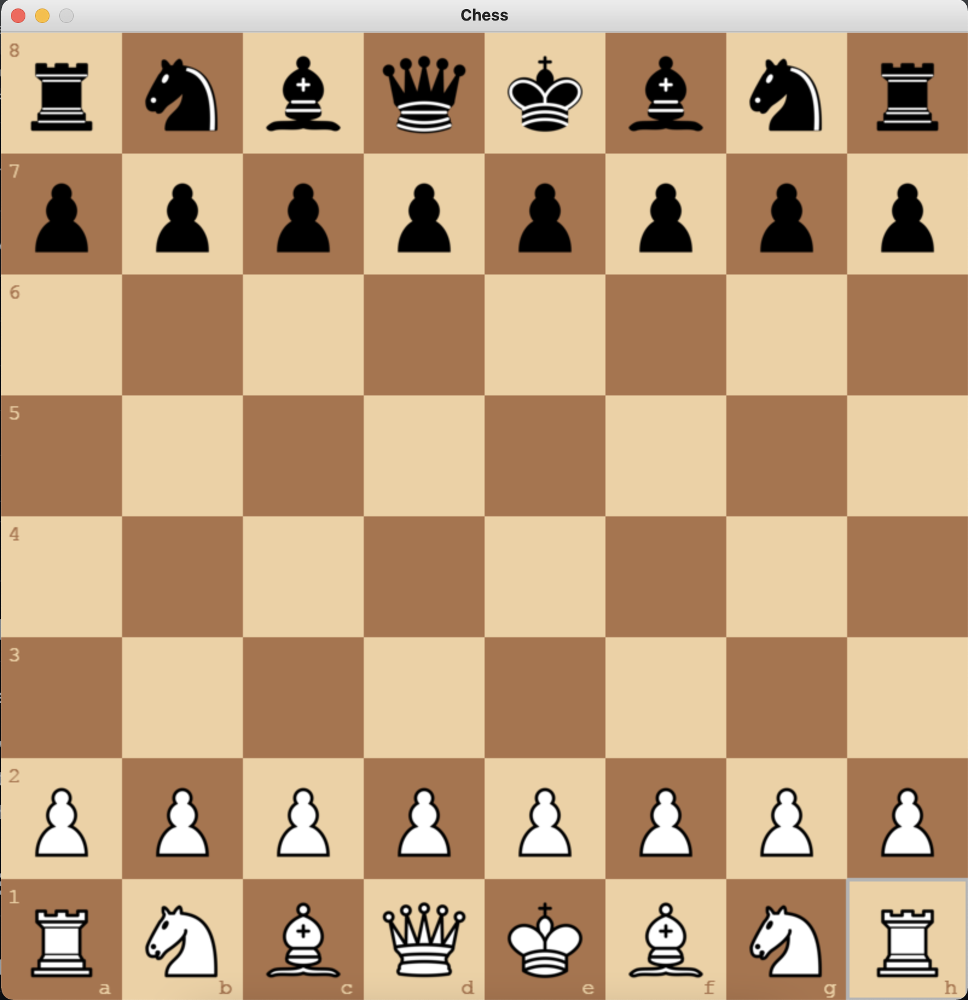

**Chess Engine**
This is a Python-based chess engine that includes several advanced features like en passant, castling, pawn promotion, sound effects, and multiple themes. The project provides a fully functional chess game with a user-friendly interface.

**Features**
# En Passant: The en passant capture rule is fully implemented.
# Castling: Both kingside and queenside castling rules are supported.
# Pawn Promotion: Automatically promotes pawns upon reaching the 8th rank, with options to choose between queen, rook, bishop, or knight.
# Sound Effects: Each move comes with sound feedback to enhance the gaming experience.
# Themes: Choose between different board and piece themes for a customizable visual experience.

**Future Enhancements**
Implementing an AI opponent.
Adding an online multiplayer option.
Saving and loading game states.
* 
- Entry point: main.py
- Press 't' to change theme (green, brown, blue, gray)
- Press 'r' to restart the game

# Game Snapshots

## Snapshot 1 - Start (green)

## Snapshot 2 - Start (brown)

## Snapshot 3 - Start (blue)

## Snapshot 4 - Start (gray)

## Snapshot 5 - Valid Moves

## Snapshot 6 - Castling

**Contributing**
Feel free to contribute by submitting issues, feature requests, or pull requests.
